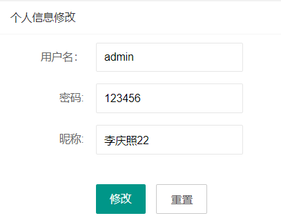

## 基于JSP+Servlet实现的学生宿舍管理系统系统

- <b>完整代码获取地址：从戎源码网 ([https://armycodes.com/](https://armycodes.com/))</b>
- <b>技术探讨、资料分享，请加QQ群：692619798</b> 
- <b>作者微信：19941326836  QQ：952045282</b> 
- <b>承接计算机毕业设计、Java毕业设计、Python毕业设计、深度学习、机器学习</b>
- <b>选题+开题报告+任务书+程序定制+安装调试+论文+答辩ppt 一条龙服务</b>
- <b>所有选题地址 ([https://github.com/YuLin-Coder/AllProjectCatalog](https://github.com/YuLin-Coder/AllProjectCatalog)) </b>

## 项目介绍
基于JSP+Servlet实现的学生宿舍管理系统系统，有学生、宿管、管理员三个角色，主要功能如下

【学生】
个人信息维护管理、查看宿舍信息、我的缺勤记录、查看公告

【宿管】
个人信息维护：查看个人信息、编辑个人信息
宿舍人员管理：宿舍人员列表、新增宿舍人员
宿舍报修管理：报修审批
人员登记管理：人员登记列表、外来人员登记
卫生考核管理：卫生考核列表、新增考核
公告管理：查看公告

【管理员】
个人信息管理：查看个人信息、编辑个人信息
学生管理：学生信息列表、新增学生信息
宿舍管理：宿舍信息列表、新增宿舍信息
宿舍人员管理：宿舍人员列表、新增宿舍人员
缺勤学生管理：缺勤学生列表、缺勤学生人员
公告管理：公告列表、新增公告

## 项目技术
- 编程语言：Java
- 数据库：MySQL
- 前端技术：JSP、JavaScript、bootstrap、JQuery
- 后端技术：Servlet、JDBC

## 运行环境
- JDK版本：JDK1.8及以上
- 开发工具：IDEA、Ecplise、Myecplise都可以
- 数据库: MySQL5.7及以上

## 运行截图

